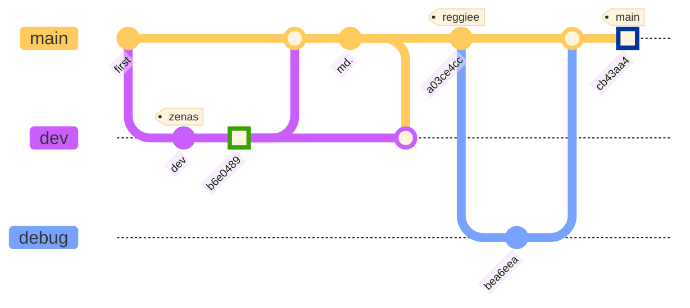

# Particles

```mermaid
%%{init: { 'logLevel': 'debug', 'theme': 'base' } }%%
gitGraph
    commit id: "first"
    branch dev
    checkout dev
    commit id:"dev" tag:"zenas"
    commit id: "b6e0489" type:HIGHLIGHT
    checkout main
    merge dev
    commit id:"md." type:NORMAL
    checkout dev
    merge main
    checkout main
    commit id: "a03ce4cc" tag:"reggiee"
    branch debug
    checkout debug
    commit id: "bea6eea"
    checkout main
    merge debug
    commit id: "cb43aa4" tag: "main" type:HIGHLIGHT
```
